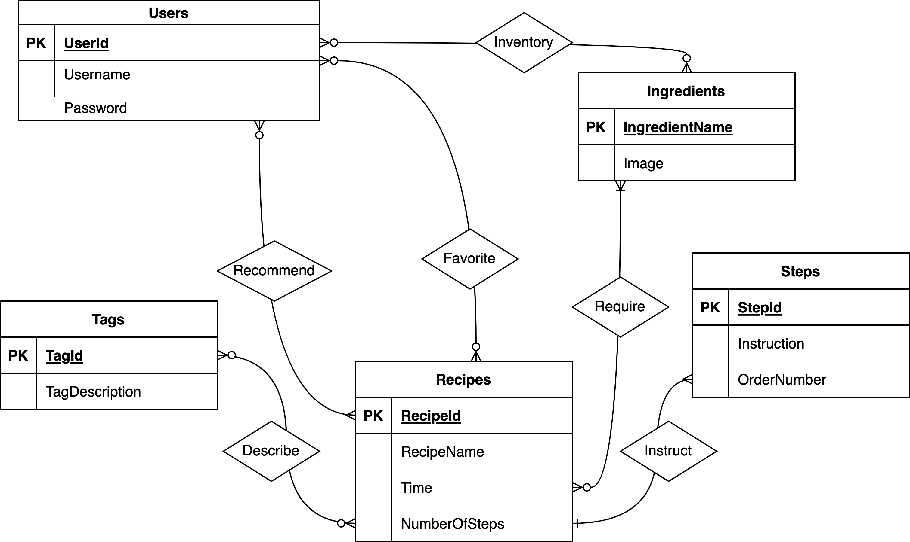

# Conceptual and Logical Database Design

## ER Diagram


## Relational Schema
```
Users(
UserId:INT[PK],	Username:VARCHAR(20),
	Password:VARCHAR(20)
)

Inventory(
UserId:INT[PK][FK to Ingredients.IngredientName],
	IngredientName:VARCHAR(50) [PK][FK to Ingredients.IngredientName]
)

Recommend(
	UserId:INT [PK][FK to Users.UserId],
	RecipeId: INT [PK] [FK to Recipes.RecipeId]
)

Favorite(
	UserId:INT [PK][FK to Users.UserId],
	RecipeId: INT [PK] [FK to Recipes.RecipeId]
)

Recipes(
	RecipeId:INT [PK],
	RecipeName:VARCHAR(100),
	Time:INT,
	NumberOfSteps:INT
)

Ingredients(
	IngredientName:VARCHAR(50) [PK],
	Image:VARBINARY(256)
)

Tags(
	TagId: INT [PK],
	TagDescription: VARCHAR(MAX)
)

Requires(
	RecipeId:INT [PK][FK to Recipes.RecipeId],
	IngredientName:VARCHAR(50) [PK][FK to Ingredients.IngredientName]
)

Steps(
    StepId: INT [PK]
    Instruction: VARCHAR(255)
    OrderNumber: INT
    Instruct: INT [FK to Recipes.RecipeId]
)

Describe(
	TagId: INT [PK][FK to Tags.TagId]
	RecipeId: INT [PK][FK to Recipes.RecipeId]
)
```

## Descriptions and Assumptions
### Entities: 

#### Login
- Description: stores a user’s login data and userId
- Assumptions: each user can manage one inventory of different ingredients and have one recommendations page with many recipe recommendations
  
#### Recipes 
- Description: stores all recipes used by our application
- Assumptions: All recipes are uniquely identified by their RecipeId (since recipe names may not be unique) and should generally have one of the other attributes that will be used to give recommendations
  
#### Steps: 
- Description: stores the different order of steps for different recipes
- Assumptions: each step can be uniquely identified by its StepId and should belong to only one recipe. The OrderNum column specifies in what order the steps should be followed in the recipe
  
#### Tags:
- Description:  stores the tags for different recipes
- Assumptions:  each tag can be uniquely identified by its TagId and could belong to many recipes. Many recipes may also include different tags.

#### Ingredients: 
- Description: stores all known ingredients and relevant image or icon for recipes and other ingredients
- Assumptions: each ingredient is uniquely identifiable by its name (there’s no two ingredients with the same name) and multiple ingredients may be used in a recipe or added to an inventory, and many recipes or inventories may include a specific ingredient

### Relationships: 
#### Inventory: 
- Description: Inventory is a many-to-many relationship between Users and Ingredients
- Assumptions: A user can manage (add/remove) as many ingredients from their inventory as they’d like, and an ingredient can be part of multiple inventories

#### Recommend:
- Description: Recommend is a many-to-many relationship between Users and Recipes
- Assumptions: A user can receive multiple recipe recommendations from our application, and a recipe may be recommended to numerous (or no) users

#### Favorite:
- Description: Favorite is a many-to-may relationship between Users and Recipes
- Assumptions: A user can like/favorite any number of recipes, and a recipe may be liked by many (or no) users

#### Require:
- Description: Require is a many optional to many mandatory relationship between Recipes and Ingredients
- Assumptions: Each recipe must contain at least one ingredient, and an ingredient can be in some recipes.

#### Instruct:
- Description: Instruct is a one-to-many relationship between Recipes and Steps 
- Assumptions: Each step can only belong to one recipe (is uniquely identified by its StepId), but a Recipe can utilize any number of steps.  

#### Describe
- Description: Describe is a many-to-many relationship between Recipes and Tags
- Assumptions: A recipe may contain multiple tags and similarly, multiple tags may be described by multiple recipes.
