# GCP Implementation 
> Proof of our GCP setup 

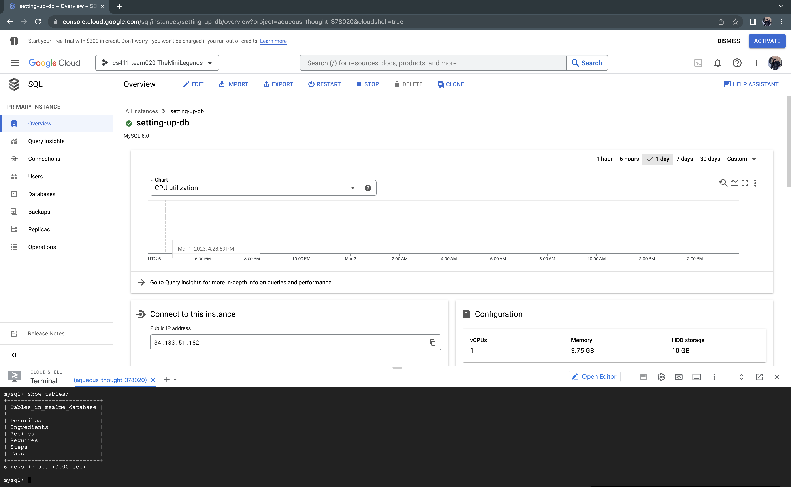

# DDL Commands and Proof of Number of Rows
> DDL commands we used to create our tables accompanied by a simple query to get the number of rows for each table


### Recipes Table: 
```
CREATE TABLE Recipes(
	RecipeId INT,
	RecipeName VARCHAR(100),
	Time INT,
	NumberOfSteps INT,
	PRIMARY KEY (RecipeId)
);
```


### Steps Table: 
```
CREATE TABLE Steps(
    StepId INT,
    Instruction VARCHAR(255),
    OrderNumber INT,
    Instruct INT,
    PRIMARY KEY (StepId),
    FOREIGN KEY (Instruct) REFERENCES Recipes(RecipeId)
);
```
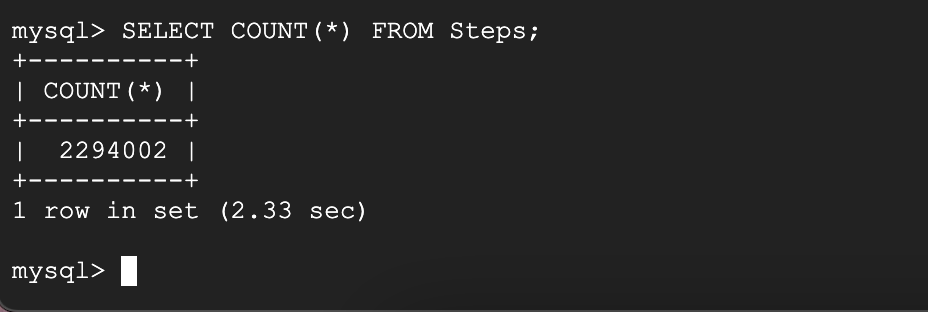

### Tags Table: 
```
CREATE TABLE Tags(
	TagId INT,
	TagDescription VARCHAR(500),
	PRIMARY KEY (TagId)
);
```
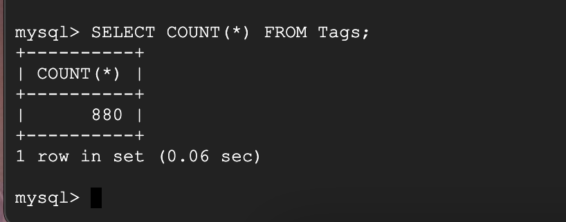

### Ingredients Table: 
```
CREATE TABLE Ingredients(
	IngredientName VARCHAR(50),
	Image VARBINARY(256),
	PRIMARY KEY (IngredientName)
);
```


### Describes Table:
```
CREATE TABLE Describes(
	TagId INT,
	RecipeId INT,
	PRIMARY KEY (TagId, RecipeId),
	FOREIGN KEY (TagId) REFERENCES Tags(TagId),
	FOREIGN KEY (RecipeId) REFERENCES Recipes(RecipeId)
);
```
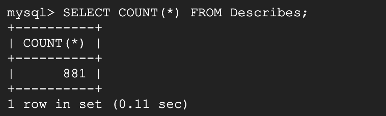

### Requires Table:
```
CREATE TABLE Requires(
	RecipeId INT,
	IngredientName VARCHAR(50),
	PRIMARY KEY (RecipeId, IngredientName),
	FOREIGN KEY (RecipeId) REFERENCES Recipes(RecipeId),
	FOREIGN KEY (IngredientName) REFERENCES Ingredients(IngredientName)
);
```


# Advanced Queries
> Two SQL queries that involve at least two of the following SQL concepts: join of multiple relations, jet operations, aggregation via GROUP BY, subqueries

## Query 1: 
### Description: 
Display the recipe name, the time it takes to cook, and the number of steps involved, and all the steps in order for each recipe

```
SELECT RecipeName, Time, NumberOfSteps, GROUP_CONCAT(Instruction 
                                                    ORDER BY OrderNumber ASC 
                                                    SEPARATOR '\n ' ) AS Instructions
FROM Recipes r JOIN Steps s ON (r.RecipeId = s.Instruct)
GROUP BY r.RecipeId;
```
### Execution: 
The output of our query 1 is formatted as such: <br>
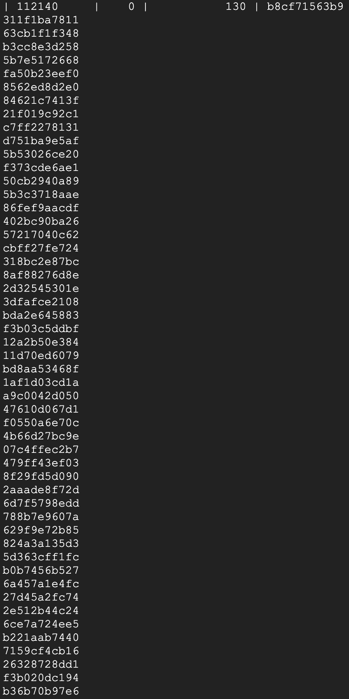
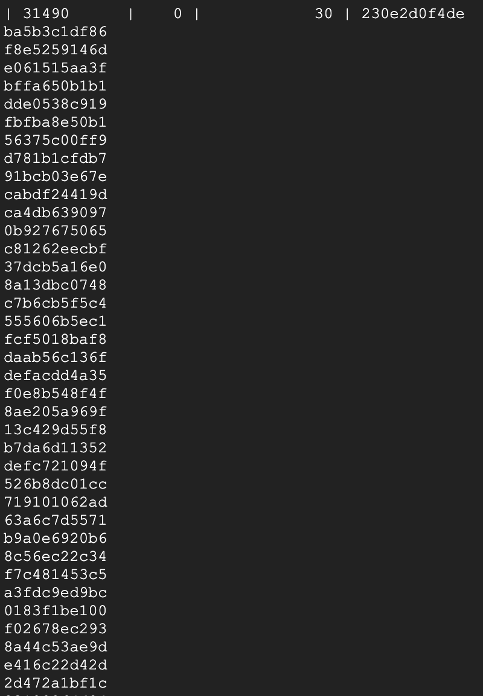 <br>
However, the output prints beyond the capacity of the terminal and it would be an extremely long image, so here's 15 rows without the Instructions Column: <br>
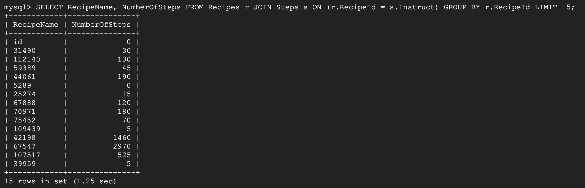


## Query 2: 
### Description: 
Gather easy and fast recipes that have less than 10 steps and require less than 10 ingredients.
```
SELECT RecipeId
FROM Recipes NATURAL JOIN Requires
WHERE NumberOfSteps <10
GROUP BY RecipeId
HAVING COUNT(IngredientName) < 10;
```

### Execution: 
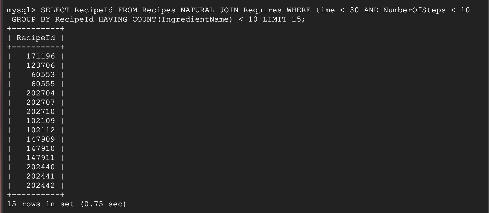


# Indexing 
> 1. Use the EXPLAIN ANALYZE command to measure your advanced query performance before adding indexes. 
> 2. Explore adding different indices to different attributes on the advanced query. For each indexing design you try, use the EXPLAIN ANALYZE command to measure the query performance after adding the indices.
> 3. Report on the index design you all select and explain why you chose it, referencing the analysis you performed in (2).
> 4. Note that if you did not find any difference in your results, report that as well. Explain why you think this change in indexing did not bring a better effect to your query.

## Query 1 Indices:

### EXPLAIN ANALYZE (No Indices) 
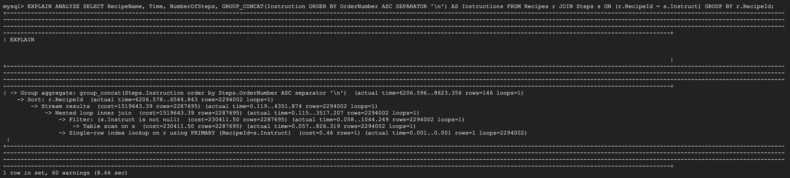<br>
A query performance of 8.66s definitely has some room for improvement

### EXPLAIN ANALYZE (Instruction)
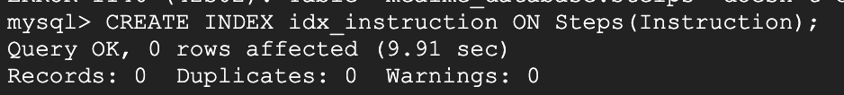
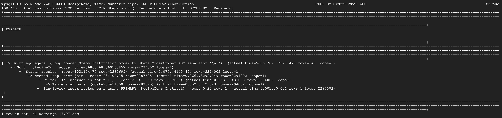 <br>
We looked at adding an index for the Instruction column in Steps because we use it for concatenating the column values into an aggregated query. Adding this index tends to slightly increase the performance of query 1. Compared to the query run with no indices (8.66s), adding in an index for Instruction runs in approximately 7.97s. 

### EXPLAIN ANALYZE (Time)
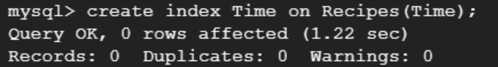
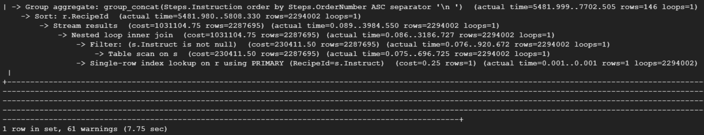 <br>
We choose this index because it is one of the indexes that we are returning. The performance time with the Time index was 0.91 seconds faster than without.

### EXPLAIN ANALYZE (RecipeName)

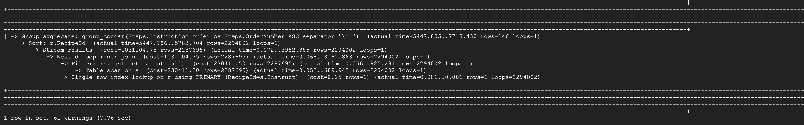 <br>
We chose to look at this index because RecipeName is one of the columns being returned. Adding an index for the RecipeName column of Recipes resulted in a slightly faster query performance (8.66s to 7.76s).

### Conclusion: 
For query 1, the addition of Instruction, Time, and RecipeName indexes all improved the runtime performance. Time and RecipeName showed the largest change which was around .90 seconds. While there was a decrease in time, it was not by much, so we conclude that the addition of indexes is not necessary, but could be slightly useful.


## Query 2 Indices:

### EXPLAIN ANALYZE (No Indices) 

It should be the slowest one as there are no indices.

### EXPLAIN ANALYZE (RecipeId)
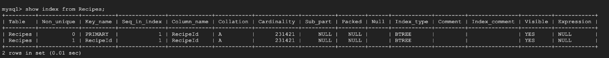
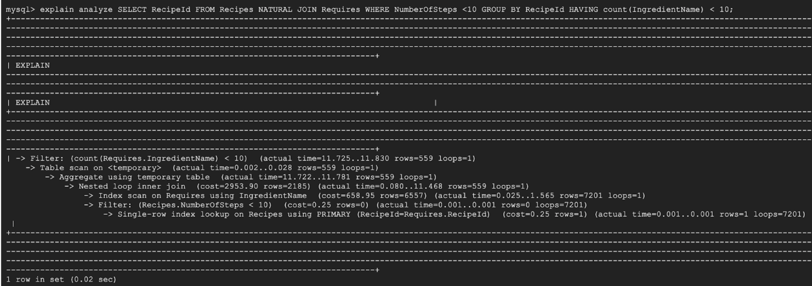 <br>
We chose to test this index because it is the primary key of the table RECIPES. We are wondering whether it is beneficial to use a BTree to index the primary key, as each primary key is unique and the total number is large. But it turns out that there is only a slight improvement and the time is still 0.02 second. We think it is probably because the primary key is already stored in the database in an efficient way. So additional BTree may not be the best choice for it.

### EXPLAIN ANALYZE (NumberOfSteps)

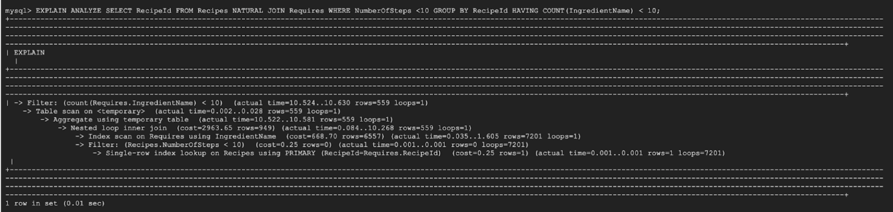 <br>
We chose to test this index because it is used in the conditional statement inside the WHERE clause of the query. We thought that since we are finding a range for the number of steps [0-10), it would be beneficial to use a BTree to index. The performance time with the NumberOfSteps index was 0.01 faster than without.

### EXPLAIN ANALYZE (IngredientName)
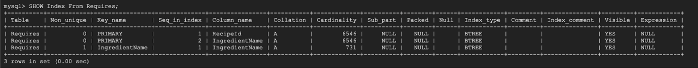
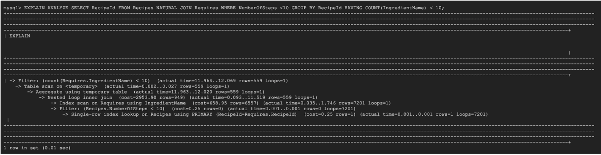 <br>
We chose to test this index because the ingredient name is used in the HAVING clause statement of the query. Even though it is used within an aggregation, we are curious to see if improving the search of an ingredient name with an index would improve the overall runtime. The performance time with the IngredientName index was 0.01 faster than without.

### Conclusion: 
For query 2, the addition of the NumberOfSteps index and IngredientName index showed the most improvement, but not by both. The addition of both of those indices, exclusively, only increased the runtime by 0.01. Our conclusion is that while the addition of those indices were helpful, they aren’t exactly necessary to use to improve the performance of the query 2.

## Current Indices: 
These are the current indices we have for our tables used in our two advanced queries: 
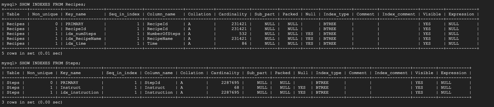 <br>
